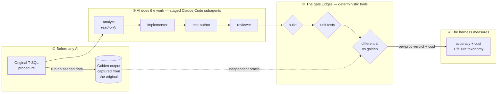
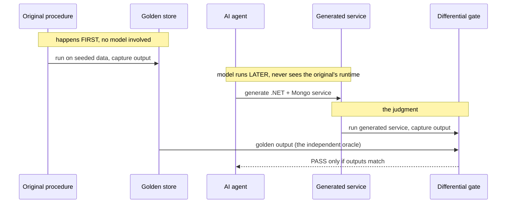
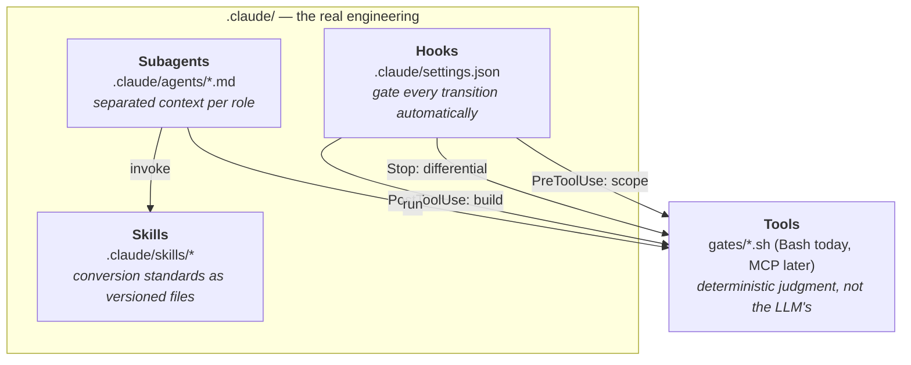

# sql-to-service

[](https://github.com/viacheslavmelnichenko/sql-to-service/actions/workflows/verify.yml)

**An engineering harness that makes an unreliable AI trustworthy on a real
migration task.**

> 🖥️ **[Live walkthrough → viacheslavmelnichenko.github.io/sql-to-service](https://viacheslavmelnichenko.github.io/sql-to-service/)** —
> a guided, step-by-step tour of the whole harness. Each step pairs a command
> with the output that proves it worked.

The task — converting legacy T-SQL stored procedures into a .NET + MongoDB
service layer — is the *vehicle*, not the point. Anyone can ask a language model
to translate code. The interesting problem is the one every team hits the moment
they try to *ship* what the model wrote: **the model is confidently wrong often
enough that you cannot trust its output without an independent way to catch it.**

This repository is that independent way. It is built **on Claude Code**, using its
native primitives — subagents, skills, hooks, and tools — so the "AI engineering"
here is real platform mechanism, not a wrapper script pretending to be an agent.

> **Status:** the gate and pipeline are built and reproducible today; the
> pre-registered eval distribution is partway in (k=1 of k=3). Two kinds of number
> live in this project, and the difference is the whole point:
> - The **gate results** exist today and are reproducible at $0 with no model call
>   — three converted procs passing their differential (10/10 cases, incl. a
>   decimal-bearing proc and a two-arm temporal join), the mutation check catching
>   12/12 injected bugs across all three (incl. the `decimal→double` precision mutant),
>   the oracle stable across 67 golden files. Run `gates/verify.sh` +
>   `gates/mutation-check.sh` and you regenerate them yourself; the
>   [walkthrough](https://viacheslavmelnichenko.github.io/sql-to-service/)
>   shows each one paired with its command.
> - The **eval numbers** — corpus-wide accuracy, per-proc cost, the failure
>   taxonomy — have **begun** to land: the Phase-4 harness (`evals/harness.py`) has
>   produced its first live sample (`run-001.sample-01.json` — three procs, $2.84–
>   $4.39 each, all cleared), but this is **k=1 of the pre-registered k=3**, so the
>   corpus-wide distribution is still settling. Where a number is not yet measured
>   this document says so plainly rather than showing a placeholder.

---

## What this proves

Not "AI can convert SQL." It can. This proves the thing that actually matters:

> *I don't ask a model to convert code — I build the system that lets you **trust**
> an unreliable model on migration work: an independent oracle that catches its
> mistakes, and measurement that proves it did.*

Three things carry that claim:

1. **A non-circular gate.** The correctness oracle is captured from the *original*
   procedure **before any model runs**, so the AI cannot collude with the thing
   that judges it.
2. **Agentic engineering, not a prompt.** Staged subagents with separated context,
   governed by skills, gated by hooks — the way a production agent is actually
   built.
3. **Honest measurement.** A harness (`evals/harness.py`, Phase 4 — running now, with
   its first live sample in) runs the real agent headless over each procedure and
   reports accuracy *and* cost, failures included — because a result with no failures
   is a finding to investigate, not a win (the first sample's 3/3 sweep is treated as
   exactly that, in `evals/results/summary.md`). The design is deliberate about *not*
   claiming the corpus-wide numbers before the full k=3 distribution completes.

---

## The flow, end to end



Read it as one sentence:

> **Golden captured before the AI → subagents do the work in stages → hooks gate
> every transition through deterministic tools → the harness measures honestly.**

The gate is the load-bearing idea. The agent's *own* generated tests never pass
the gate on their own — they could be wrong in the same direction as the code.
Only the **differential** — the generated service's output compared value-by-value,
after canonicalisation, against the golden output captured before the model existed
— has the authority to say "this conversion is correct." (Canonicalisation means
decimals are rendered at a fixed scale and object keys sorted first, so a cosmetic
representation difference never masks — or fakes — a real one.)

---

## Why the gate is non-circular

The failure mode of every "the AI tested its own work" demo is circularity: the
model writes the code *and* the tests, so the tests encode the same
misunderstanding as the code, and both agree while both are wrong.



Because the golden output is frozen before the agent starts, there is no path for
the model to influence the oracle. The oracle is a fact about the *original
system*, not an opinion the model helped form.

One more guard: the MongoDB side of the comparison is seeded by **fixed,
committed migration code** — a pure function of the relational seed, written
before any conversion — so we don't quietly relocate the oracle problem into a
hand-fitted document store.

---

## Built on Claude Code — the four primitives

This is where "AI engineering" stops being a slogan. Each stage of the pipeline is
a real Claude Code mechanism, not a renamed function. Open `.claude/` and, if you
know Claude Code, you recognise the primitives on sight.



| Primitive | Where it lives | What it proves |
| --- | --- | --- |
| **Subagents** | `.claude/agents/{analyst,implementer,test-author,reviewer}.md` | Context separation is built in, not imitated. The `analyst` is read-only and writes a spec; the `test-author` writes tests without seeing what was convenient for the `implementer`. |
| **Skills** | `.claude/skills/*` | Conversion knowledge (how to map `decimal` → `Decimal128`, how to model a result set as a document) lives in versioned files the `reviewer` checks against — not in an ephemeral prompt. |
| **Hooks** | `.claude/settings.json` | `PostToolUse` builds after every write; `Stop` runs the differential before the agent may finish; `PreToolUse` blocks writes outside allowed folders. Gates run *in the loop*, not after the fact. |
| **Tools** | `gates/*.sh` (Bash now; an MCP server is a planned stretch) | The gate is a deterministic tool the agent *calls* — the model never grades itself. |

The harness runs Claude Code **headless** (`claude -p …`) once per procedure and
collects the real token cost from each run, so the reported numbers come from actual
agent executions, not mocks. To be exact about what has run: the headless loop has
produced its **first live sample** (`run-001.sample-01.json`) — three procs driven
end to end by the real agent, each cleared against the frozen golden — and the
pre-registered **k=3** distribution is in progress (k=1 measured). No number here is
presented as a settled corpus-wide result before that distribution completes.

---

## Following one conversion end to end

The repository is designed to be read **without running it** — the run path
exists to make the numbers falsifiable, not to be the experience. Follow one
conversion end to end, entirely in committed files:

```
corpus/procs/<Proc>.sql          →  the original input
generated/<Proc>Service.cs        →  what the agent produced
corpus/golden/<Proc>.json         →  the oracle, captured before the agent
evals/results/run-*.json          →  the per-proc verdict and cost
```

*(These paths are populated for the three converted procs today —
`Website.SearchForCustomers`, `Integration.GetStockHoldingUpdates`,
`Integration.GetTransactionUpdates`. The corpus carries the inputs and goldens for
the rest of the selected tier; they convert as the harness runs.)*

---

## Reproduce (for anyone who runs it)

Standing the whole thing up is deliberately production-realistic and therefore
heavy: it restores a public sample database and runs a real agent.

```sh
cp .env.example .env         # add your model API key; .env is gitignored
docker compose up -d         # SQL Server on :11433, MongoDB on :37017
./corpus/restore.sh          # restore + seed the sample DB (pinned .bak, SHA-checked)
./gates/verify.sh            # build + unit + differential against committed output
                             #   → reproduces the published table, with NO model calls
bash evals/run.sh            # scaffold check, no model, $0 (writes dry-run.json)
bash evals/run.sh --live     # optional, PAID: re-run the agent end to end
                             #   → drives the harness; full runbook in evals/RUNNING.md
```

`verify.sh` is the audit: it regenerates the reported results from committed
artifacts without calling any model, and it exists today. `evals/run.sh` defaults
to a **dry run** (the harness with no model, measuring the committed services for
free); `--live` is a separate, opt-in, paid command that drives the real agent —
so nothing here surprises you with a bill. The complete operational runbook, both
POSIX and Windows, with the environment traps spelled out, is
[`evals/RUNNING.md`](evals/RUNNING.md).

Ports `11433` / `37017` are non-standard on purpose, to avoid colliding with a
SQL Server or MongoDB you may already run locally.

---

## What this is *not*

Stating the scope limits up front is credibility, not modesty:

- **Not a transpiler.** A deterministic SQL-to-C# converter would be *less* AI, not
  more. The point is trusting a model where a transpiler can't reach (idiomatic
  service code, document modeling, semantic intent).
- **Not a benchmark of "how good the AI is."** It measures whether the *harness*
  catches the AI when it's wrong, and what that costs.
- **Not a biography.** This is a demonstration artifact. It carries no real client,
  product, or engagement data. The corpus is the public MIT-licensed
  WideWorldImporters sample. Any magnitudes here are the demo's own, measured on
  the demo — they do not stand in for figures from any real engagement.
- **Not applicable to every procedure.** The non-circular oracle rests on being able
  to capture a golden output from the original proc and re-read it later — which
  works only for procs that are **read-only** (no base-table write), **deterministic**
  (no `NEWID`/`GETDATE`/`SYSDATETIME` or other session-dependent state), and return a
  **single result set**. Those are exactly `corpus/SELECTION.md`'s inclusion criteria,
  and they are a hard ceiling, not a matter of effort: a proc that mutates state has no
  stable output to capture, and a non-deterministic one produces a different "golden"
  every run. In a real backlog the majority of procedures write state, branch on the
  clock, or return multiple shapes — and they need a *different* harness (snapshot-and-
  compare against captured DB state before/after, transaction-rollback around the run),
  not the value differential shown here. This repo addresses the tractable tier
  correctly and says exactly where that tier ends; nothing here claims the method
  generalises to a whole corpus untouched.

---

## Layout

```
.claude/            the engineering — subagents, skills, hooks (the hero)
  agents/           analyst · implementer · test-author · reviewer
  skills/           conversion standards the reviewer checks against
  settings.json     hooks that gate each transition
corpus/
  procs/            original T-SQL procedures (the input)
  golden/           output captured from the originals, before any model
  seed/             relational seed + fixed migration to the Mongo seed
gates/              build · unit · differential · verify (deterministic tools)
generated/          what the agent produced (the vehicle's output)
evals/              the harness, the method, and the results
docs/               architecture and decision records (ADRs)
demo/               a guided, step-by-step walkthrough (open demo/index.html)
```

---

## Documentation

Everything, in reading order, is indexed in **[`docs/README.md`](docs/README.md)**
— the architecture, the seven ADRs, the pipeline's retry protocol, the eval
preregistration, and the corpus provenance. New here? The **[`demo/`](demo/)**
walkthrough is the fastest way in.

---

## License

[MIT](LICENSE). The corpus is the public MIT-licensed WideWorldImporters sample
(see [`corpus/SOURCE.md`](corpus/SOURCE.md)); this repository carries no real
client, product, or engagement data.
