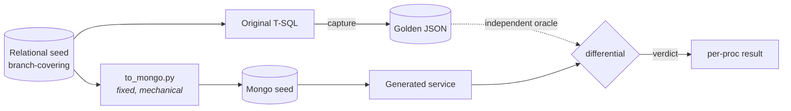
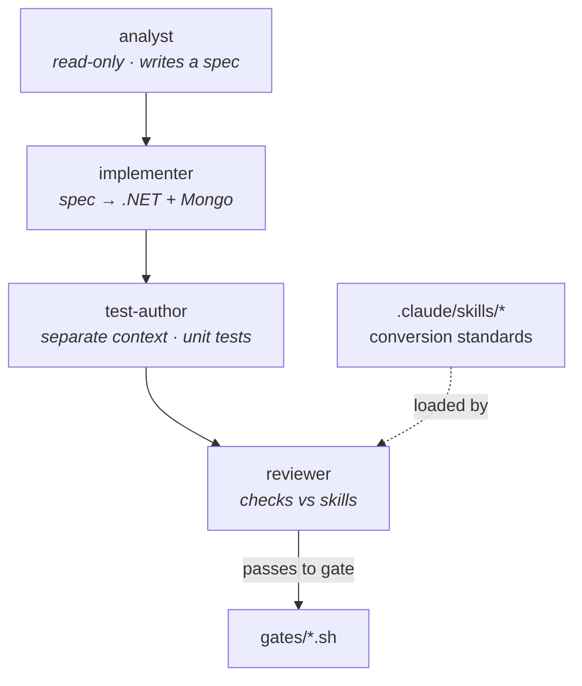
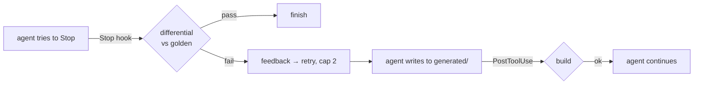

# Architecture

This expands the three README diagrams into the reasoning behind them. The README
answers *what*; this answers *why it is shaped this way*. It is a permanent
document — it outlives the task tracker.

The whole design serves one claim: **that an unreliable model can be trusted on a
migration task, because an independent oracle catches its mistakes and a harness
measures that it did.** Every structural decision below is downstream of that.

---

## 1. The shape of the problem

Converting a T-SQL stored procedure into a .NET + MongoDB service is a task a model
can *attempt* easily and get *subtly wrong* often: an off-by-one in pagination, a
dropped optional filter, a relevance ordering that looks right but isn't, a decimal
that loses precision crossing into `Decimal128`. None of these fail loudly. All of
them fail a customer.

So the engineering problem is not "convert" — it's "**know when the conversion is
wrong**, cheaply, without a human reading every line." That is an oracle problem,
and it drives everything.

---

## 2. The oracle, captured before the AI

The golden output is captured from the **original procedure**, on a **branch-
covering seed**, **before any model runs** (ADR-0001). It is a fact about the
original system. The model cannot influence it because it does not exist yet when
the golden is frozen.

Two subtleties the diagram encodes:

- **Both sides descend from the same seed.** The golden comes from the original
  T-SQL over the relational seed; the Mongo data comes from a **fixed mechanical
  migration** (`to_mongo.py`) of the *same* relational seed (ADR-0003). Neither
  side is fitted to the other, so the comparison stays honest. If we hand-authored
  the Mongo documents, we'd have moved the oracle problem, not solved it.
- **The seed is sized by branch coverage, not volume** (ADR-0002). It exists to
  make every branch produce a *distinguishable* output — proven by the mandatory
  mutation check (ADR-0006), not assumed.

---

## 3. The agent, staged on Claude Code

Four **subagents** with genuinely separated context (ADR-0004), not one prompt in a
loop:

- **`analyst`** reads the T-SQL and writes a specification of *intent*. Read-only —
  it writes no code, so the implementer starts from an understanding, not a
  translation.
- **`implementer`** turns the spec into an idiomatic .NET service over the
  fixed Mongo document model.
- **`test-author`** writes unit tests in a **separate context**, so it doesn't
  encode "what was convenient for the implementer" — it works from the spec.
- **`reviewer`** checks the output against **skills** (`.claude/skills/*`) — the
  conversion standards as versioned files, not advice in a prompt.

The staging is the point: separated context is what stops the code and its tests
from sharing a blind spot. That's also *why the agent's own tests never pass the
gate alone* — they could be wrong in the same direction as the code (ADR-0001).

---

## 4. The gate, in-loop via hooks

**Hooks** (`.claude/settings.json`) make gating a property of the loop, not a
post-hoc script:

- **`PostToolUse`** builds after every write to `generated/` — a non-compiling
  service never advances.
- **`Stop`** runs the differential before the agent may finish — a conversion that
  doesn't match golden cannot be declared done; the failure is fed back as
  structured feedback and the agent retries (cap 2).
- **`PreToolUse`** blocks writes outside allowed folders — the agent can't wander.

The gate-tools themselves are **Bash scripts** (ADR-0005) — the same artifact the
agent calls, the hook invokes, and a human reads. `verify.sh` composes
build + unit + differential and reproduces the published results **with no model
calls**, which is what makes the numbers auditable.

And the gate's authority is **proven, not asserted**: `mutation-check.sh`
(ADR-0006, mandatory) injects known bugs and requires the gate to catch every one.

---

## 5. The harness, measuring honestly

> **Status:** built and running (Phase 4). `evals/harness.py` drives the agent over
> the corpus and has produced its first live sample (`run-001.sample-01.json`,
> snapshot `claude-opus-4-8`); the pre-registered **k=3** distribution is in
> progress (k=1 measured). See [`../evals/results/summary.md`](../evals/results/summary.md).

The harness runs Claude Code **headless** (`claude -p …`) once per procedure and
records, per proc: the differential verdict, retries used, tokens, and cost. It runs
once per **sample**; across the pre-registered `k=3` samples,
[`evals/aggregate.py`](../evals/aggregate.py) reports a **distribution**, flags
`flaky` procedures, and audits that each sample genuinely regenerated (a 0-turn
sample is not an independent measurement). A result with no failures is treated as a
**finding to investigate**, not a win (PREREGISTRATION.md, H3). A naive
single-prompt run is kept as the **control baseline** (B.4).

The one artifact that cannot be faked is the **analysis paragraph** in
`evals/results/summary.md`: what the run showed, read against the prediction —
including, when the sweep is clean, *why* that is a caveat rather than a headline.
Writing it truthfully requires having done the work.

The operational detail — how to actually run this (dry vs live, POSIX vs Windows),
the prerequisites, and the authentication traps — lives in the runbook,
[`../evals/RUNNING.md`](../evals/RUNNING.md).

---

## 6. Why not the obvious alternatives

- **Why not a deterministic transpiler?** It would be *less* AI, not more, and it
  can't reach idiomatic service code or document modeling. The point is trusting a
  model where a transpiler can't go.
- **Why not let the AI test itself?** Circular — the tests inherit the code's
  misunderstanding (ADR-0001).
- **Why not hand-author the Mongo data?** It relocates the oracle problem into a
  fitted document store (ADR-0003).
- **Why not trust the gate by design?** Because "should catch" isn't "was shown to
  catch" — the artifact refuses that assertion about the AI, so it can't make it
  about its own gate (ADR-0006).

---

## 7. Decision record

| ADR | Decision |
| --- | --- |
| [0001](adr/0001-non-circular-gate.md) | Golden captured before any model runs |
| [0002](adr/0002-dataset-sizing.md) | Dataset sized by branch coverage, not volume |
| [0003](adr/0003-mechanical-mongo-seed.md) | Mongo seed is a pure function of the relational seed |
| [0004](adr/0004-claude-code-substrate.md) | Built on Claude Code — real agents/skills/hooks/tools |
| [0005](adr/0005-tools-bash-then-mcp.md) | Bash gate-tools now, MCP as a stretch |
| [0006](adr/0006-mutation-validation.md) | Mandatory mutation check proves the gate has teeth |
