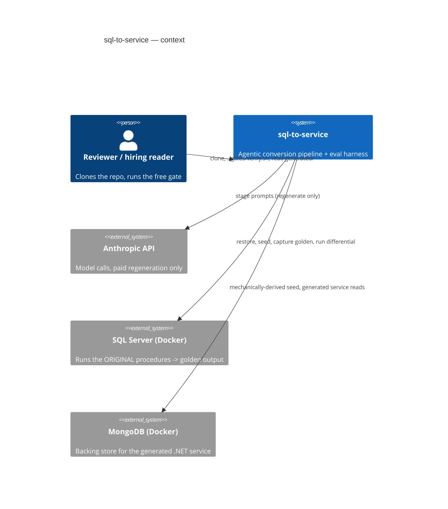
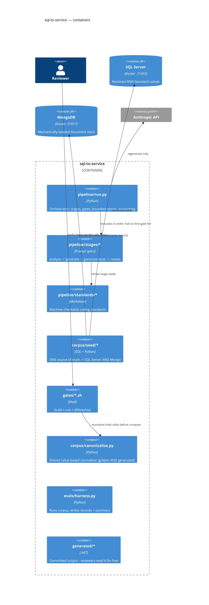

# Artifact B — Implementation Plan

`sql-to-service`: an agentic pipeline that converts T-SQL stored procedures into a
.NET service layer, gated by **differential testing against captured golden
output**, plus an eval harness that reports how often it works and what it costs.

This plan is the Definition-of-Ready artifact for the build. It is deliberately
concrete about the parts that are load-bearing (the gate, golden capture, the
**SQL→Mongo seed**, determinism, the metric definition) and defers only the parts
that can be known solely by running against the restored database (exact float
tolerances, per-proc JSON shape). The SDLC discipline: **the selection criterion
and the full candidate enumeration are committed before any run, and no procedure
is dropped after the fact.**

> **Revision note (v2).** This version closes the findings from a three-critic
> review. The load-bearing fixes: (1) the differential gate's MongoDB side now
> has an explicit, mechanically-derived seed so the non-circularity argument
> actually holds; (2) demo numbers are decoupled from the résumé's engagement
> numbers, with the gap explained up front; (3) the headline metric is redefined
> to be mechanically checkable; (4) the corpus criterion is corrected to a schema
> that actually yields 12–20 procs and now deliberately includes semantically
> non-trivial procedures. Details in §12 (change log).

---

## 0. What this plan must satisfy

Every unit of work traces to a claim in the résumé — but the demo **proves the
method, not the engagement's magnitudes**. The distinction is enforced in §0.1.

| Résumé claim | What the demo backs, honestly | Where |
| --- | --- | --- |
| 2 agentic pipelines, build/test gates, halt-on-first-failure | `pipeline/run.py` orchestrator, gates between stages | E2 |
| 83 % clear gates unedited *(engagement)* | demo reports **its own** pass rate on its own corpus; method, not the 83 % | E3 |
| remaining 17 % escalate to review *(engagement)* | demo's failure taxonomy table (Table 2) | E3 |
| ~$25/proc, down from ~$60 *(engagement)* | demo reports **its own** cost and a run-001→run-002 **delta**; the delta shape, not the $25 | E4 |
| ADRs/standards encoded into skills | `docs/adr/` (6) + `pipeline/standards/` referenced by the review stage | E2, E4 |
| weekly flow that regenerates what drifted | `--drift` re-run mode — **committed, not stretch** (see B3-5) | E3 |
| integration tests vs real Mongo + SQL Server in Docker | gates run against both containers | E1–E2 |

### 0.1 Demo numbers vs engagement numbers (the overclaiming firewall)

A reviewer who reads both the résumé and this repo will see the demo's cost
(cents/proc) and pass rate differ from the résumé's ~$25/proc and 83 %. That is
expected and must be **stated first, not discovered**:

- The résumé's 83 % / ~$25 are the **private engagement**: a large payment-domain
  corpus, mutation-heavy procedures, a human-in-the-loop review step, on a
  frontier model tier.
- This repo proves the **method and the measurement discipline** on a small,
  public, read-heavy corpus with **no human editing**. Its numbers are its own.
- `README.md` and `evals/METHOD.md` carry a one-paragraph "Why these numbers
  differ from a real engagement" note (corpus size, procedure complexity, model
  tier, absence of a human review loop). The demo never maps its headline onto
  the résumé's figures. **The delta between run-001 and run-002 is the only cost
  claim the demo makes on its own authority.**

The headline metric is `cleared_within_cap` (renamed from `cleared_unedited` —
see §8): **passed build, unit, and differential gates within the retry cap, with
the committed output byte-identical to what `run.py` produced (no post-hoc
edit).** Stated once in `METHOD.md`, mechanically checkable (§8).

---

## 1. Size and what it licenses skipping

Classified **S** (`docs/features/artifact-b/.size`). Four axes: ~2–5 logical PRs;
~a week calendar; one new module with a DB seed, no production migration; no
breaking change for any consumer (greenfield). Just above XS for the DB /
golden-capture / Mongo-seed rig.

Per `00-overview/mvp-vs-full.md`, **S** licenses skipping full arc42, C4 component
(L3), deployment diagram, and a separate test-plan file (inline here in §7).
**Security-review is NOT skipped** — the toolkit gates it on *public / API /
data-heavy*, and this artifact is all three (public profile, downloads a `.bak`
from a URL, handles an API key + SA password). It is present as §9. Also present:
goals mapping, architecture with C4 L1/L2 inline, six Accepted ADRs authored
**before** code, data/seed model, task breakdown with DoR/DoD for **all** four
evenings, inline G/W/T test plan, CHANGELOG, KB note, DoD.

---

## 2. Environment (verified 2026-08-07)

- `docker` 29.5.3, `docker compose` v5.1.4 — present.
- `sqlcmd` present (`.../ODBC/170/Tools/Binn`).
- A `mssql/server:2022-latest` and a `mongo:7.0` container are already running
  locally (1433 / 27017) **from unrelated work** — proof the toolchain works, but
  the artifact must not depend on them. `sql-to-service` ships its own compose on
  **11433 / 37017** so a clone never collides.

Implication: golden capture, the Mongo seed, and the differential gate are
executed for real on this machine. No `golden/*.json` is fabricated.

---

## 3. Architecture sketch (C4 L1 + L2 inline)

### System context (L1)



### Container view (L2)



### 3.1 The two decisions that carry the artifact

**(a) The gate is non-circular.** Golden output is captured from the **original**
procedure **before any model is involved**; the differential gate compares the
generated .NET's output against that golden JSON. Agent-written unit tests exist
(document intent, catch regressions cheaply) but **never** pass the gate alone.

**(b) The Mongo side is mechanically derived, not hand-fitted** *(the fix a critic
flagged as the load-bearing hole)*. The generated .NET service reads MongoDB, so
the differential gate is only honest if Mongo holds the faithful equivalent of the
SQL seed. Therefore a single committed **seed source of truth** deterministically
populates *both* stores: `corpus/seed/relational.sql` seeds SQL Server, and
`corpus/seed/to_mongo.py` — **fixed migration code checked in before any
conversion, not authored to make outputs match** — derives the Mongo documents
from the *same* row source. A test (§7 AC-9) asserts the Mongo seed is a pure
function of the relational seed. If the Mongo seed were tuned until the diff
passed, the oracle would merely be relocated; this task order (seed code frozen
before conversion) is what prevents that.

---

## 4. ADRs — authored NOW, Accepted at the gate

DoR requires ADRs `Accepted` before the first line of code. The decisions are
already made in §3/§5, so all six are written during plan finalisation, one page
each (context / decision / consequences), in `docs/adr/`, `Status: Accepted`:

1. `0001-differential-testing-against-golden-output.md`
2. `0002-halt-on-first-failure-between-stages.md`
3. `0003-retry-cap-of-2-published-in-results.md`
4. `0004-commit-generated-output-to-the-repo.md`
5. `0005-split-ci-free-verify-vs-paid-regenerate.md`
6. `0006-corpus-criterion-and-mechanical-mongo-seed.md` *(covers both the
   no-cherry-pick criterion and why the Mongo seed is mechanically derived)*

These ARE the "encoded governance" claim in miniature — the demo ships 6, the
résumé's larger count belongs to the engagement (§0.1 firewall).

---

## 5. Evening 1 — the foundation

> *"Longest and least glamorous. Do not skip; everything depends on it."* Golden
> capture and the Mongo seed are not prep — they are part of the gate. Built
> before any conversion exists. Critic feedback split this across **1.5 evenings**
> honestly; the tasks below are sized ≤1 day regardless.

### 5.1 Corpus source and acquisition

- **Source:** Microsoft `WideWorldImporters`, the **Standard** backup
  (`WideWorldImporters-Standard.bak`), MIT, from the pinned GitHub release
  `microsoft/sql-server-samples` (`.../releases/download/wide-world-importers-v1.0/`).
  **Standard, not Full** — the Full backup carries memory-optimized filegroups and
  full-text catalogs that need extra container memory/components and fail to
  recover cleanly in a Linux mssql container. Standard restores cleanly and
  contains every target procedure. *(Critic 1 finding 4.)*
- **Scripted, pinned, not committed:** `corpus/restore.sh` downloads the `.bak`
  (pinned URL + SHA-256) and restores it. The `.bak` is not committed (size +
  licence hygiene); `restore.sh` and the extracted `procs/*.sql` are. DB collation
  pinned to `Latin1_General_100_CI_AS` (WWI default) and asserted after restore.

### 5.2 Selection criterion (committed BEFORE the list; corrected schema)

Written into `corpus/SELECTION.md` and committed with the **full candidate
enumeration** before any run:

> **Every stored procedure in the `Integration` and `Website` schemas that
> (a) returns exactly one result set, (b) takes ≤ 5 scalar parameters,
> (c) is read-only (no INSERT/UPDATE/DELETE/MERGE against base tables), and
> (d) is deterministic once its datetime cutoff parameters are frozen in the
> fixture.**

Why this schema set (correcting v1, which named only `Website` and would have
yielded ~5): *(Critic 1 finding 1)*

- `Website.SearchFor*` — 5 read-only single-result-set procs
  (`SearchForCustomers`, `SearchForPeople`, `SearchForStockItems`,
  `SearchForStockItemsByTags`, `SearchForSuppliers`). Semantically non-trivial:
  multi-table joins, relevance `ORDER BY`, `CASE` logic — this is the "real work"
  a critic wanted, not tutorial lookups. *(Critic 2 finding 3.)*
- `Integration.Get*Updates` — the ETL read family (`GetCustomerUpdates`,
  `GetOrderUpdates`, `GetSaleUpdates`, `GetStockItemUpdates`,
  `GetSupplierUpdates`, `GetTransactionUpdates`, `GetMovementUpdates`,
  `GetPurchaseUpdates`, …). Read-only, single result set, take
  `@LastCutoff/@NewCutoff datetime2` (freezable → deterministic). ~12–13 procs.
  They read temporal history (`FOR SYSTEM_TIME`) — a **new determinism surface**
  explicitly documented in §5.3.

Together: ~17–18 candidates → comfortably in the 12–20 band with a hard cap of 20.
The enumeration query `corpus/select.sql` is committed and prints the full
candidate list; **every proc it selects is kept**, and the excluded set (with
per-proc reasons) is committed in the *same commit* as `SELECTION.md`, before any
run, so exclusions are auditable against raw `select.sql` output — closing the
clause-(d) cherry-pick channel a critic flagged. *(Critic 2 finding 5.)*

### 5.3 Determinism handling (the golden-capture trap)

| Source | Mitigation |
| --- | --- |
| `@Cutoff` datetime params | frozen to fixed literals in the fixture; part of the golden key |
| `FOR SYSTEM_TIME` temporal reads | seed writes history at fixed, explicit `datetime2` values; no wall-clock reads |
| `SYSDATETIME/GETUTCDATE/NEWID` inside a proc | excluded by clause (d), logged |
| Row order without a unique tiebreak | capture query appends a **unique** key (entity id) to `ORDER BY`; the same sort applied to generated output — ties can't reorder between stores *(Critic 1 finding 6)* |
| `money`/`decimal` scale (`25.00` vs `25.0000`) | canonicaliser compares numerics **by value** (parse to Decimal, normalise scale), never as text *(Critic 1 finding 3 — CRITICAL for the Mongo round-trip)* |
| `float`/`real` | exact for decimal/money; fixed relative tolerance for float, stated in `METHOD.md` |
| collation-sensitive compare | DB + column collation pinned in restore; documented |
| NULL vs empty vs missing key | canonicaliser: explicit `null`, keys always present |

Determinism verified two ways: `verify-stable.sh` captures each proc twice within
a seed **and** once more after a full `down -v` + re-restore + re-seed, asserting
byte-identical canonical JSON across a cold rebuild (not just within one live DB —
a critic noted the same-seed check passes too trivially). Unstable procs excluded
and logged. *(Critic 1 finding 5.)*

### 5.4 Seed fixtures — ONE source of truth, both stores

- `corpus/seed/relational.sql`: bounded, deterministic subset (fixed customers /
  stock items / people / orders by stable IDs), enough to exercise each selected
  proc's branches (match, no-match, NULL in a nullable column, boundary,
  temporal-cutoff straddle). Idempotent (truncate + explicit-ID insert,
  `SET IDENTITY_INSERT` where needed). Designed **after** the proc list, targeting
  the exact columns those procs read.
- `corpus/seed/to_mongo.py`: **fixed migration code**, committed before any
  conversion, that reads the *same* relational rows and writes the Mongo document
  seed. Pure function of `relational.sql`; contains no per-proc special-casing.
  This is what makes the differential gate honest rather than circular (§3.1b).

### 5.5 Golden capture

- `corpus/capture-golden.sh`: for each selected proc, execute against the seeded
  SQL Server with frozen inputs, serialise the single result set to **canonical
  JSON** via the shared `corpus/canonicalise.py`, write
  `corpus/golden/<schema>.<proc>.json`.
- Both golden capture and the differential gate call the *same* `canonicalise.py`,
  so golden and generated output are normalised by identical (value-based) code —
  structurally preventing an asymmetric-normalisation false pass.

### 5.6 docker-compose

- `docker-compose.yml`: `mssql/server:2022-latest` on **11433**, `mongo:7.0` on
  **37017**, healthchecks, named volumes, `SA` password + Mongo creds from `.env`
  (never committed; `env.example` documents it — named `env.example` not
  `.env.example` due to a local permission block on `.env*`). Container memory set
  high enough for a Standard restore.
- `corpus/restore.sh` waits on the mssql healthcheck, restores the `.bak`, asserts
  collation, runs `relational.sql`, runs `to_mongo.py`, then `capture-golden.sh`.
  One command from clone to golden files + a seeded Mongo.

### 5.7 Evening-1 task breakdown (≤1 day each, execution-ordered IDs)

Renumbered so IDs follow topological order (a critic noted v1's B1-4→B1-5 read
backward). DAG: B1-1 → B1-2 → B1-3 → B1-4(list) → B1-5(seed) → B1-6(mongo-seed) →
B1-7(capture) → B1-8(stability).

| # | Task | DoR | DoD |
| --- | --- | --- | --- |
| B1-1 | `docker-compose.yml` + `env.example`, ports 11433/37017, healthchecks, memory for Standard restore | env verified (§2) | `docker compose up -d` → both healthy; `sqlcmd` connects on 11433 |
| B1-2 | `corpus/restore.sh` — pinned `.bak` (URL+SHA), restore, assert collation | B1-1 | `down -v && up` + restore → WWI present, collation asserted, idempotent |
| B1-3 | `corpus/SELECTION.md` criterion + `select.sql`; commit criterion + full candidate list + exclusions **before any run** | B1-2 | criterion + candidates + exclusions committed together; `select.sql` reproduces the list |
| B1-4 | Run criterion, freeze selected list, extract `procs/*.sql` | B1-3 | 12–20 procs; every selected proc kept; exclusions logged with reason |
| B1-5 | `corpus/seed/relational.sql` bounded deterministic subset | B1-4 | idempotent; each proc has match/no-match/NULL/boundary/temporal rows |
| B1-6 | `corpus/seed/to_mongo.py` mechanical Mongo seed from same rows | B1-5 | Mongo seed is a pure function of relational seed (AC-9 test passes) |
| B1-7 | `canonicalise.py` (value-based) + `capture-golden.sh` → `golden/*.json` | B1-5, B1-6 | one canonical JSON per proc (sorted, explicit null, numeric-by-value) |
| B1-8 | `verify-stable.sh` — double capture + cold-rebuild capture, assert byte-identical | B1-7 | all kept procs stable across cold rebuild; unstable excluded + logged |

Evening-1 exit gate: a stranger runs `docker compose up -d && ./corpus/restore.sh`
and ends with committed stable golden files, a seeded Mongo derived mechanically
from the same source, and a committed selection criterion + candidate list whose
output is reproducible. **No model has run yet** — by design.

---

## 6. Evenings 2–4 — task breakdown (now to the same standard as E1)

*(Critic 3 finding 1: v1 left these as prose. Decomposed to ≤1-day tasks with
DoR/DoD.)*

### Evening 2 — stages, gates, one procedure end-to-end

| # | Task | DoR | DoD |
| --- | --- | --- | --- |
| B2-1 | `pipeline/stages/{01-analyse,02-generate,03-generate-tests,04-review}.md` with explicit inputs/outputs + forbidden actions | E1 done | each stage spec states what it may read and may not do |
| B2-2 | `pipeline/standards/*.md` — 4–6 machine-checkable standards (money/decimal type + rounding, null-mapping, result-set→DTO shape, async/IO) | B2-1 | each standard has a mechanical check the review stage can apply |
| B2-3 | `gates/build.sh`, `gates/unit.sh`, `gates/differential.sh` (via shared canonicaliser) | B1-7 | each exits non-zero on failure with a row-level diff for differential |
| B2-4 | `pipeline/run.py`: stages in order, **halt on first gate fail**, retry cap 2, per-attempt accounting, resumable | B2-1..B2-3 | forced-fail tests (§7 AC-4,5) pass; state resumable after kill |
| B2-5 | Prove one procedure end-to-end; hand-verify output vs golden | B2-4 | one proc clears all three gates; recorded as `cleared_within_cap` |

ADRs 0001, 0002 already Accepted (§4).

### Evening 3 — harness, metrics, first full run (run-001)

| # | Task | DoR | DoD |
| --- | --- | --- | --- |
| B3-1 | `evals/harness.py`: iterate corpus, invoke `run.py`, write one record/proc (schema §8) | B2-5 | `results/run-001.json` produced; every record has full accounting (AC-6) |
| B3-2 | Aggregate → `results/summary.md` Table 1 + Table 2 | B3-1 | tables filled with real numbers |
| B3-3 | Write the 2–3 sentence differential-failure analysis paragraph | B3-2 | the paragraph exists and names concrete mismatch causes |
| B3-4 | `cleared_within_cap` checksum invariant enforced in harness (§8) | B3-1 | AC-7 test passes: an edited output flips the flag false |
| B3-5 | `--drift` re-run mode: detect a changed source proc via content hash, regenerate only it | B3-1 | change one proc → only it regenerates; backs the résumé "drift" clause |

ADRs 0003, 0006 already Accepted. **First run will surface a broken assumption —
budgeted for.**

### Evening 4 — optimisation pass, run-002, README, CI, security note

| # | Task | DoR | DoD |
| --- | --- | --- | --- |
| B4-1 | Optimisation pass: trim stage inputs, cache stable prefix, tighten prompts; re-run → run-002 | B3-2 | `results/run-002.json` produced |
| B4-2 | `README.md` first screen: results table + reproduce + "what this is not" + §0.1 firewall paragraph | B4-1 | first screen matches PUBLIC_ARTIFACT skeleton; numbers-differ note present |
| B4-3 | `evals/METHOD.md`: define `cleared_within_cap`, retry cap, determinism, float tolerance, demo-vs-engagement note | B4-1 | metric defined mechanically; firewall stated |
| B4-4 | CI `verify.yml` (every push, no model calls, containerised SQL Server, free) + `regenerate.yml` (`workflow_dispatch`, needs key) | B2-3 | verify.yml green with zero network to Anthropic (AC-8) |
| B4-5 | `docs/SECURITY.md` note (§9), CHANGELOG entry, KB note with backlinks to ADRs | B4-2 | all three committed |

ADRs 0004, 0005 already Accepted.

---

## 7. Test plan (inline, Given/When/Then — S size)

The gates ARE the tests for the conversion; the harness is tested separately so a
harness bug cannot fake a pass rate. *(Critic 3 finding 6: rewritten as G/W/T.)*

- **AC-1 Golden capture is stable.** *Given* a selected proc and frozen seed,
  *when* `verify-stable.sh` captures it twice plus once after a cold rebuild,
  *then* all three canonical JSONs are byte-identical.
- **AC-2 Differential gate has teeth (negative).** *Given* a deliberately
  wrong generated output, *when* `differential.sh` runs, *then* it exits non-zero
  with a row-level diff.
- **AC-3 Differential gate passes correct output.** *Given* the hand-verified proc
  from B2-5, *when* the gate runs, *then* it exits zero.
- **AC-4 Halt-on-first-failure.** *Given* stage-2 build fails, *when* `run.py`
  executes, *then* stage-3 never runs and the run halts.
- **AC-5 Retry cap respected.** *Given* a perpetually failing stage, *when*
  `run.py` executes, *then* exactly 2 attempts occur, then escalate.
- **AC-6 Accounting complete.** *Given* any finished record, *when* inspected,
  *then* it has tokens in/out/cache, cost, wall-clock, and `first_failed_gate`.
- **AC-7 Metric is edit-sensitive.** *Given* a proc whose committed output is
  altered after `run.py` produced it, *when* the harness recomputes the flag,
  *then* `cleared_within_cap` is false (checksum mismatch — §8).
- **AC-8 verify.yml makes no model calls.** *Given* a CI verify run, *when* it
  executes, *then* there is zero network egress to Anthropic.
- **AC-9 Mongo seed is mechanical.** *Given* `relational.sql` and `to_mongo.py`,
  *when* the Mongo seed is regenerated from the relational rows, *then* it is
  byte-identical to the committed Mongo seed (no hand-tuning to fit the diff).
- **AC-10 Canonicaliser symmetry.** *Given* golden and generated output, *when*
  compared, *then* both were normalised by the same value-based `canonicalise.py`.

Negative tests (AC-2, AC-9) matter most: a gate that never fails is not a gate,
and a Mongo seed hand-fitted to the diff is not an oracle.

---

## 8. Metric definition and schema (mechanical)

`cleared_within_cap` replaces `cleared_unedited` because the demo has **no human
in the loop**, so "unedited" was vacuously always true. *(Critic 2 finding 4,
Critic 3 finding 2.)* Mechanical definition, in `METHOD.md`:

> `cleared_within_cap = true` iff the procedure passed build, unit, and
> differential gates within the retry cap (≤2), **and** the committed file in
> `generated/` is byte-identical (SHA-256) to the artifact `run.py` produced on
> the clearing attempt. Any post-hoc edit to the committed output flips it false
> (AC-7). This anchors the honesty in a checksum, not a promise.

One record per procedure per run:

```json
{
  "run_id": "run-001",
  "procedure": "Integration.GetOrderUpdates",
  "cleared_within_cap": false,
  "output_sha256": "…",
  "attempts": { "analyse": 1, "generate": 2, "tests": 1, "review": 1 },
  "first_failed_gate": "differential",
  "failure_detail": "3 of 40 rows differ in NULL handling of a nullable column",
  "cost_usd": 0.34,
  "tokens": { "in": 412000, "out": 9100, "cache_read": 355000 },
  "wall_clock_s": 214,
  "generated_loc": { "impl": 121, "tests": 168 }
}
```

`first_failed_gate` ∈ `{build, unit, differential, retry_cap, null}`; `null` =
cleared. Drives Table 2 directly. No accounting → no artifact.

---

## 9. Security review (NOT skipped — data/API-gated)

*(Critic 3 finding 4.)* Consolidated in `docs/SECURITY.md`:

| Surface | Control |
| --- | --- |
| Downloaded `.bak` (supply chain) | pinned release URL + SHA-256 verified before restore; fail closed on mismatch |
| Anthropic API key | from environment only; `.env` gitignored; `regenerate.yml` uses a GitHub secret; `verify.yml` has no key and makes no model calls (AC-8) |
| SA / Mongo passwords | from `.env`; never committed; `env.example` shows placeholders |
| Container exposure | non-standard host ports; bound to localhost; not exposed publicly |
| Generated code committed | reviewed as data, not executed in CI beyond the gates; no secrets embedded |
| Client-data leakage | corpus is public WWI only; §0.1 firewall; no engagement artefact anywhere |

---

## 10. Risks and mitigations

| Risk | Likelihood | Mitigation |
| --- | --- | --- |
| Golden capture unstable across cold rebuild | high | double + cold-rebuild verify; value-based numeric compare; exclude-and-log (§5.3) |
| Mongo seed accidentally hand-fitted → circular gate | medium / fatal to credibility | seed code frozen before conversion; AC-9 asserts it's a pure function of relational seed (§3.1b) |
| `money`/`decimal` round-trip via Decimal128 breaks compare | high | canonicaliser compares by value, normalises scale (§5.3) |
| `Integration`/`Website` yield < 12 procs | low (corrected schema ~17–18) | criterion widening documented, never silent; hard cap 20 |
| First full run breaks an assumption | high (expected) | E3 budgets for it |
| Demo numbers read as contradicting the résumé | high | §0.1 firewall stated first in README + METHOD |
| Corpus reads as tutorial-trivial | medium | `SearchFor*` bring real joins/relevance/CASE; failure analysis about genuine semantic mismatches (§5.2) |
| Scope creep (50 procs, UI, multi-provider) | medium | hard cap 20; single provider; no UI; "what this is not" |
| Secrets committed | low / fatal | `.env` gitignored; `env.example` only; no key in `verify.yml` |
| Standard `.bak` restore fails on memory | low | Standard (not Full); container memory sized in B1-1 |

---

## 11. Definition of Done

- [ ] Stranger can clone, run `./gates/verify.sh`, see it pass.
- [ ] README first screen shows the results table + the demo-vs-engagement note.
- [ ] `evals/METHOD.md` defines `cleared_within_cap` mechanically.
- [ ] Failure taxonomy published with a paragraph of analysis.
- [ ] Two runs published with a cost delta and an explanation.
- [ ] Selection criterion + full candidate list + exclusions committed **before**
      `procs/*.sql` (verifiable in git history — mechanical, not a promise).
- [ ] Mongo seed proven mechanical (AC-9 green).
- [ ] 6 ADRs, all `Accepted`.
- [ ] `docs/SECURITY.md` present.
- [ ] CI green, no secrets, `.env` ignored, verify.yml makes no model calls.
- [ ] CHANGELOG entry + KB note with ADR backlinks.
- [ ] Self-attestation: nothing traceable to any client engagement (attestation,
      not a machine gate — stated as such).
- [ ] Repository pinned on the GitHub profile.

---

## 12. Change log vs v1 (what the three-critic review changed)

- **CRITICAL — Mongo data path:** added the mechanically-derived seed (§3.1b,
  §5.4, B1-6, AC-9) so the differential gate is non-circular in fact, not just on
  the SQL side.
- **CRITICAL — overclaiming firewall:** §0.1 decouples demo numbers from the
  engagement's 83 %/$25 and explains the gap up front.
- **CRITICAL/MAJOR — metric:** `cleared_unedited` → `cleared_within_cap` with a
  checksum definition (§8) that is actually mechanical and edit-sensitive.
- **MAJOR — corpus:** criterion corrected from `Website`-only (~5 procs) to
  `Integration` + `Website` (~17–18), deliberately including semantically
  non-trivial `SearchFor*`; `Standard.bak` not `Full`.
- **MAJOR — task breakdown:** Evenings 2–4 decomposed to ≤1-day tasks with
  DoR/DoD (§6); IDs renumbered to topological order.
- **MAJOR — ADRs:** authored now, `Accepted` at the gate (§4), not deferred.
- **MAJOR — security review:** kept, not skipped; §9 + `docs/SECURITY.md`.
- **MAJOR — G/W/T + KB/CONTEXT:** §7 ACs rewritten as Given/When/Then; KB note and
  CHANGELOG added to DoD (B4-5); drift mode promoted from stretch to committed
  (B3-5) so §0's drift claim has a backing task.
- **MINOR — determinism:** cold-rebuild stability check; unique-key tiebreak;
  value-based numeric compare; auditable exclusion list.

---

## Introduced specifics (named per project convention, overrule cheaply)

Choices this plan adds beyond `PUBLIC_ARTIFACT.md`, surfaced so they can be
overruled while still one line:

- **Corpus = `Integration.Get*Updates` + `Website.SearchFor*`** on WWI **Standard**
  — a concrete criterion that actually yields 12–20 and isn't all trivial.
- **Mechanically-derived Mongo seed** (`to_mongo.py`, frozen before conversion) —
  the specific mechanism that keeps the gate non-circular.
- **Metric renamed `cleared_within_cap` + SHA-256 output invariant** — because the
  demo has no human editing loop.
- **Non-standard host ports 11433 / 37017** — avoid colliding with existing 1433/27017.
- **Value-based shared canonicaliser** — prevents decimal/Decimal128 false failures.
- **Drift mode committed (B3-5), not stretch** — to back the résumé's drift clause.
- **net8.0 LTS default** for the generated service — pending E2 confirmation.
