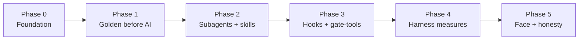

# Task tracker — scaffolding, not an artifact

This folder is **temporary**. It exists to drive the build of `sql-to-service`
from empty repo to working harness. The moment a phase is done, its tasks are
**deleted or converted into the de-facto implementation** — because the artifacts
themselves become the record. A tracker row is a promise; the file it points to is
the proof. When the file exists and passes its gate, the row is redundant.

> **Lifecycle rule.** Nothing here is load-bearing after implementation.
> - **Task rows** → deleted once their target file exists and is gated.
> - **Design docs that outlive the build** (ADRs, architecture) → *moved* into
>   `docs/`, not deleted. They are marked `[permanent]` below.
> - When every phase is `done`, this whole folder is removed in one commit.

Every task names **one target file** (or a small, cohesive set). "Done" is not an
opinion — it is: *the file exists, and the gate that judges it is green.*

---

## The spine we are building

```
Golden (before AI)  →  subagents work in stages, armed with skills
                    →  hooks gate each transition through tool-scripts
                    →  the harness measures honestly.
```

Four phases map onto that one sentence. Build them in order — each phase's output
is the next phase's input.



---

## Status legend

`todo` · `wip` · `blocked` · `done` · `cut` (dropped, with a one-line why)

Each task also carries a **fate** — what happens to it after the build:
`delete` (scaffolding) · `becomes-impl` (the row's target file is the deliverable)
· `permanent` (a doc that stays in `docs/`).

---

## Phase 0 — Foundation *(decisions frozen before any code)*

| # | Task | Target file | Status | Fate |
|---|------|-------------|--------|------|
| 0.1 | Pick corpus source + pin (URL + SHA) | `corpus/SOURCE.md` | done | permanent |
| 0.2 | Selection criterion + full candidate list + exclusions | `corpus/SELECTION.md` | done | permanent |
| 0.3 | Dataset-sizing decision (branch-coverage, not volume) | `docs/adr/0002-dataset-sizing.md` | done | permanent |
| 0.4 | ADR-0001 non-circular gate (golden before model) | `docs/adr/0001-non-circular-gate.md` | done | permanent |
| 0.5 | ADR-0003 mechanical Mongo seed (pure fn of relational seed) | `docs/adr/0003-mechanical-mongo-seed.md` | done | permanent |
| 0.6 | ADR-0004 Claude Code as substrate (agents/skills/hooks/tools) | `docs/adr/0004-claude-code-substrate.md` | done | permanent |
| 0.7 | ADR-0005 Bash gate-tools now, MCP as stretch | `docs/adr/0005-tools-bash-then-mcp.md` | done | permanent |
| 0.8 | ADR-0006 mutation check as gate-validation | `docs/adr/0006-mutation-validation.md` | done | permanent |
| 0.9 | Architecture doc (the 3 README diagrams, expanded) | `docs/architecture.md` | done | permanent |
| 0.10 | Pre-registration: hypotheses + thresholds before run-001 | `evals/PREREGISTRATION.md` | done | permanent |

> **0.2 closed in Phase 1:** the selection *criterion* was frozen in Phase 0; the
> full candidate table + exclusions were then filled by `corpus/select.sql` run
> against the restored DB (18 pass the mechanical screen, corpus = 14 `IN`, 6
> base-writers excluded). Criterion 1 was refined from "no INSERT/UPDATE/DELETE"
> to "no *base-table* write" so the `#temp`-only `Get*Updates` are admitted.

**Phase-0 exit:** every decision the later phases depend on is written and
`Accepted`. No pipeline code until this is green.

---

## Phase 1 — Golden before AI *(the oracle, captured with no model in the room)*

| # | Task | Target file | Status | Fate |
|---|------|-------------|--------|------|
| 1.1 | `docker compose`: SQL Server :11433 + Mongo :37017 + healthchecks | `docker-compose.yml` | done | becomes-impl |
| 1.2 | Restore + seed script (pinned .bak, SHA-checked, loud-failing) | `corpus/restore.sh` | done | becomes-impl |
| 1.3 | Extract the selected procedures verbatim | `corpus/procs/*.sql` | done | becomes-impl |
| 1.4 | Relational seed — branch-covering rows per §0.3 | `corpus/seed/relational.sql` | done | becomes-impl |
| 1.5 | Param-case sets per procedure (5–8, branch-covering) | `corpus/cases/*.json` | done | becomes-impl |
| 1.6 | Capture golden output from originals | `corpus/golden/*.json`, `corpus/capture-golden.{sh,py}` | done | becomes-impl |
| 1.7 | Canonicalise golden (stable ordering, numeric normalisation) | `corpus/canonicalise.py` | done | becomes-impl |
| 1.8 | Mechanical Mongo seed (pure fn of relational seed) | `corpus/seed/to_mongo.py` | done | becomes-impl |
| 1.9 | Stability check: golden identical across two captures | `gates/verify-stable.sh` | done | becomes-impl |

> **Phase 1 built in two tranches (ADR-0007), both now complete.** Tranche 1 — the
> 11 tractable procs — seeds 16 branch-covering tables and 51 golden files.
> **Tranche 2** — the 3 temporal procs (`GetCustomer/Supplier/CityUpdates`) — is
> now folded into the same `relational.sql`: the four shared tables are made
> system-versioned *in place* (migrate-existing-data, fixed-literal history, so it
> stays deterministic), the lookup dimensions and `*_Archive` history are added,
> and `geography` is captured as Well-Known-Text (`.STAsText()`) since `FOR JSON`
> refuses a CLR type. The temp-table procs defeat `describe_first_result_set`
> (error 11526), so their case files carry an explicit `resultset` transcribed from
> the proc's own `#...Changes` table. Result: **14 procs, 67 golden files,
> byte-identical across two captures**; tranche-1 golden is unchanged (the in-place
> conversion did not leak). See ADR-0007 "Tranche 2 as built".

**Phase-1 exit:** golden exists, is deterministic across re-captures, and was
produced with zero model involvement. This is the foundation of trust — it must
be right before any agent runs.

---

## Phase 2 — Subagents work in stages, armed with skills

| # | Task | Target file | Status | Fate |
|---|------|-------------|--------|------|
| 2.1 | `analyst` subagent — read-only, writes a spec, no code | `.claude/agents/analyst.md` | done | becomes-impl |
| 2.2 | `implementer` subagent — spec → .NET + Mongo | `.claude/agents/implementer.md` | done | becomes-impl |
| 2.3 | `test-author` subagent — separate context, writes unit tests | `.claude/agents/test-author.md` | done | becomes-impl |
| 2.4 | `reviewer` subagent — checks against skills | `.claude/agents/reviewer.md` | done | becomes-impl |
| 2.5 | Skill: T-SQL semantics → service intent | `.claude/skills/tsql-semantics/SKILL.md` | done | becomes-impl |
| 2.6 | Skill: `decimal` → `Decimal128` round-trip rules | `.claude/skills/decimal-mapping/SKILL.md` | done | becomes-impl |
| 2.7 | Skill: result-set → Mongo document modelling | `.claude/skills/document-modelling/SKILL.md` | done | becomes-impl |
| 2.8 | Skill: idiomatic .NET service shape | `.claude/skills/dotnet-service-shape/SKILL.md` | done | becomes-impl |
| 2.9 | One showcase conversion end to end (a substantive `SearchFor*`) | `generated/SearchForCustomersService.cs` | done | becomes-impl |

> **Phase 2 as built.** The four subagents are real Claude Code agents with
> separated tool-sets, not renamed prompts: `analyst` is read-only + Write (spec
> only, no code), `implementer` and `test-author` write under `generated/` in
> separate contexts (so the tests can't inherit the code's blind spot, per
> ADR-0001), and `reviewer` has **no** Write/Edit — it reads, loads the skills, and
> runs the gate. The four skills are versioned `SKILL.md` files grounded in the
> actual corpus (the FOR JSON AUTO nesting rules, CONCAT null-swallowing,
> decimal→Decimal128 at scale 4, the idiomatic service shape). The showcase is
> `Website.SearchForCustomers` — the hardest conversion in the corpus (three-table
> join, INNER-drops vs LEFT-keeps, CONCAT search, TOP-after-ORDER, and FOR JSON
> AUTO nesting rebuilt from flat collections). It runs through all four stages by
> hand: `generated/Website.SearchForCustomers.spec.md` → `SearchForCustomersService.cs`
> + `Program.cs` → `tests/` → `.review.md`. Both projects build on .NET 10 and
> **6/6 tests pass**, each asserting the service output equals golden after the
> gate's own `canonicalise.py` — so the differential is already green on every
> case. The standalone `gates/*.sh` and the in-loop hooks are Phase 3.

**Phase-2 exit:** the four subagents exist with genuinely separated context and
tool-sets (not renamed prompts), the skills are versioned files the reviewer
loads, and one substantive conversion runs through all four stages by hand.
**Met:** see "Phase 2 as built" above.

---

## Phase 3 — Hooks gate each transition through tool-scripts

| # | Task | Target file | Status | Fate |
|---|------|-------------|--------|------|
| 3.1 | Gate tool: build the generated service | `gates/build.sh` | done | becomes-impl |
| 3.2 | Gate tool: run agent-written unit tests | `gates/unit.sh` | done | becomes-impl |
| 3.3 | Gate tool: differential vs golden (value-based compare) | `gates/differential.sh` | done | becomes-impl |
| 3.4 | Gate tool: `verify.sh` = build+unit+diff, no model calls | `gates/verify.sh` | done | becomes-impl |
| 3.5 | Hook `PostToolUse` → build after every write to `generated/` | `.claude/settings.json` | done | becomes-impl |
| 3.6 | Hook `Stop` → differential must pass before agent may finish | `.claude/settings.json` | done | becomes-impl |
| 3.7 | Hook `PreToolUse` → block writes outside allowed folders | `.claude/settings.json` | done | becomes-impl |
| 3.8 | Retry feedback: gate failure fed back to agent (cap 2) | `pipeline/retry.md` | done | becomes-impl |
| 3.9 | **Gate-validation via mutation (MANDATORY)**: inject known bugs, prove the gate catches every one | `gates/mutation-check.sh` | done | becomes-impl |

> **3.9 is not optional and is not a stretch item.** A differential gate that has
> never been shown to fail on a wrong conversion is an untested gate — its green
> is worth nothing. The mutation set (drop a `WHERE`, break an `ORDER BY`, shift
> pagination, swap a join) is committed, and each mutant the gate *fails to catch*
> is a dataset hole (see §0.3) that must be closed before Phase 3 exits. This is
> the artifact that turns "we have tests" into "we proved the tests have teeth."

> **Phase 3 as built.** Four gate scripts, three hooks, one retry doc, one
> mutation check.
>
> *The gates* (`gates/*.sh`) are plain POSIX-sh, callable by hook, human or CI with
> no model in the loop (ADR-0005). `build.sh` compiles only `generated/` in Release
> and tolerates the NuGet NU1902/NU1903 advisories (they are not compile errors);
> `unit.sh` runs the agent-written xunit tests against their own isolated DB;
> `differential.sh` is load-bearing — it seeds Mongo, builds **once**, then runs the
> compiled binary so stdout is clean JSON, and compares each case to golden through
> the gate's own `canonicalise.py` (`--ordered`, since the proc has an `ORDER BY`).
> `verify.sh` chains build→unit→diff fail-fast. On the showcase: build PASS, **6/6
> unit, 5/5 differential**, zero model calls.
>
> *The hooks* (`.claude/settings.json`, thin scripts under `.claude/hooks/`) wire
> the gates into the agent loop via the exit-2 feedback convention: `PostToolUse`
> builds after any `.cs`/`.csproj` write under `generated/` and hands a compile
> break straight back; `Stop` blocks the agent from finishing while the differential
> is red; `PreToolUse` (`guard-path`) fails **closed** — it allows writes only under
> `generated/` (plus the OS temp dir) and refuses everything else, so a green gate
> can never mean "the agent edited the oracle to match its output" (ADR-0001/0004).
> Paths resolve via `$CLAUDE_PROJECT_DIR`; all three were pipe-tested against
> synthetic tool-call payloads (allow `generated/`, block `corpus/`, pass through
> non-write tools).
>
> *The retry protocol* (`pipeline/retry.md`) splits the error path in two: the hooks
> are the in-loop half (fast, memoryless corrections), and the **cap of 2** lives in
> the Phase-4 harness, not the hooks — the cap is what makes "never lies" also
> "always terminates," and it records a capped-out proc as an honest failure rather
> than retrying until the number looks good.
>
> *The teeth* are proven, not asserted: `gates/mutation-check.sh` injects single-line
> bugs into each converted service and requires the differential to turn red on
> **every** one. At Phase-3 exit that was five bugs into the showcase
> (`SearchForCustomers`: drop-where, break-order, shift-pagination, drop-join,
> type-coercion), all caught — with one honest scope note in the script header: the
> ADR-0006 `decimal→double` precision mutant had no target in that proc (it returns
> no decimal column), so `type-coercion` stood in for the wrong-numeric class.
> **That gap is now closed:** as the decimal proc (`GetStockHoldingUpdates`) and the
> two-arm temporal proc (`GetTransactionUpdates`) were converted, each got its own
> catalogue, and the corpus-wide check now injects **12 bugs across three procs and
> catches all 12** — including the real `decimal→double` precision-loss mutant,
> anchored on the load-bearing `8.00` seed row. Two teeth are deliberately *not*
> claimed, and the script says so rather than faking them: `GetStockHoldingUpdates`
> has no join to break, and `GetTransactionUpdates`'s seed has no row where the
> invoice and transaction CustomerID differ, so a break-join/coalesce mutant there
> would be a no-op branch hole (ADR-0002) — omitted, not silently passed.

**Phase-3 exit:** every transition is gated automatically in-loop, the
differential has teeth (**proven** by the mandatory mutation check catching every
injected bug — a single uncaught mutant blocks exit), and `verify.sh` reproduces a
verdict with no model calls. **Met:** see "Phase 3 as built" above.

---

## Phase 4 — The harness measures honestly

| # | Task | Target file | Status | Fate |
|---|------|-------------|--------|------|
| 4.1 | Harness: run Claude Code headless per proc, collect cost | `evals/harness.py` | done | becomes-impl |
| 4.2 | Per-proc outcome record (verdict + retries + tokens + $) | `evals/results/run-001.json` | done | becomes-impl |
| 4.3 | k=3 runs; report distribution, flag `flaky` | `evals/results/run-001.sample-0N.json` + `aggregate.py` | wip | becomes-impl |
| 4.4 | Structured run trace (auditable after the fact) | `evals/results/debug/*` (opt-in `EVAL_DEBUG`) | wip | becomes-impl |
| 4.5 | Metric definitions (cost model, cache control, small-n honesty) | `evals/METHOD.md` | todo | permanent |
| 4.6 | Summary: Table 1 (headline) + Table 2 (failure taxonomy) + analysis | `evals/results/summary.md` | done | becomes-impl |
| 4.7 | Naive single-prompt baseline (the control) | `evals/results/baseline.json` | todo | becomes-impl |

> **Phase 4 as built (k=1 of k=3).** The harness (`evals/harness.py`) is real and
> runs two ways: `--dry-run` (no model, measures the committed artifacts — what CI
> runs) and live (`claude -p` per proc, real API spend, opt-in behind
> `EVAL_LIVE_OK`/`run.sh`). It enforces the retry cap of 2, and computes the
> pre-registered `cleared_within_cap` as a mechanical SHA-256 identity between the
> freshly-built service's canonical output and the frozen golden — not a judgment.
> The first **live sample** is in: `run-001.sample-01.json` (three procs, each
> cleared on the first attempt, $2.84–$4.39/proc), stitched into `run-001.json` by
> `evals/aggregate.py`. That is **k=1 of the pre-registered k=3** (4.3 stays `wip`
> until the two remaining samples run), and the 3/3 clean sweep is written up as a
> finding to investigate under H3, not a headline (`evals/results/summary.md`).
> Still open: the k=3 distribution (4.3), the metric doc (4.5), and the naive
> single-prompt baseline/control (4.7 — the B.4 task). The cost reconciliation the
> sample forced — the projected $0.70/attempt was ~5× low against the measured
> ~$3.64/proc, because an agentic attempt re-bills 24–44 turns — is recorded in the
> demo and `summary.md` rather than quietly corrected.

**Phase-4 exit:** the numbers come from real headless agent runs, the failure
taxonomy has an analysis paragraph (the one artifact that can't be faked), and
`verify.sh` output matches the published table. **Partly met:** the harness and the
first live sample are in (k=1); the k=3 distribution, `METHOD.md`, and the baseline
control remain.

---

## Phase 5 — The face + honesty layer

| # | Task | Target file | Status | Fate |
|---|------|-------------|--------|------|
| 5.1 | README: fill the Status → results, wire the 4-link read-without-running chain | `README.md` | done | permanent |
| 5.2 | CI `verify.yml` (free, no model) + green badge on line 1 | `.github/workflows/verify.yml` | done | becomes-impl |
| 5.3 | CI `regenerate.yml` (paid, opt-in) | `.github/workflows/regenerate.yml` | todo | becomes-impl |
| 5.4 | `SECURITY.md`: supply-chain (.bak SHA), secret handling | `docs/SECURITY.md` | done | permanent |
| 5.5 | `CHANGELOG.md` | `CHANGELOG.md` | todo | permanent |
| 5.6 | Repo public + pinned on profile *(manual)* | — | todo | delete |

> **Phase 5 as built (the honesty layer, mostly in).** The README carries the
> Status block reconciled to what actually runs (three converted procs, 10/10
> differential cases, 12/12 mutants, k=1 of k=3), the four-link
> read-without-running chain, and the applicability-ceiling and demo-vs-reality
> firewall. CI (`.github/workflows/verify.yml`) runs the same `make`-free gate on
> every push — `docker compose up`, `gates/verify.sh`, `gates/mutation-check.sh`,
> and `harness.py --dry-run` — with **no model call**, so the line-1 badge is
> GitHub vouching for the free, deterministic half. `docs/SECURITY.md` states the
> secret-handling, PII-synthesis prerequisite, and supply-chain pinning. Still
> open, deliberately: the paid `regenerate.yml` (5.3), `CHANGELOG.md` (5.5), and
> the manual "make the repo public" step (5.6).

**Phase-5 exit:** a reviewer landing cold gets the verdict in 90 seconds, can
follow one conversion end to end without running anything, and sees a green badge
that GitHub — not the author — vouches for. **Met for the parts that ship in the
repo;** the paid regenerate workflow, changelog, and go-public step remain.

---

## What else we should fix in docs (beyond tasks)

These are not build steps; they are decisions/records that keep the story from
contradicting itself. Most are Phase-0 ADRs above; flagged here so none is lost:

- **Number registry.** A single place every figure is tabulated, so `README`,
  `summary.md`, and `architecture.md` never disagree. → `evals/METHOD.md` §canon.
- **Demo-vs-reality firewall.** One paragraph, stated once, that the demo's
  magnitudes are the demo's own and stand in for no real engagement. → already in
  README "What this is not"; keep it the single source.
- **"How done is measured" per phase.** The exit lines above are the contract;
  when a phase closes, its exit line moves into the permanent doc it validated.
- **Cut-list.** When a task is `cut`, record the one-line why here so a reviewer
  doesn't read an absence as an oversight.

---

## Conversion protocol (how this folder dies)

1. A task's target file lands and passes its gate → set row `done`.
2. All rows in a phase `done` → delete that phase's task table; its **exit line**
   is copied into the permanent doc it produced (ADR / architecture / METHOD).
3. `permanent`-fate items are already in `docs/` — nothing to move, just stop
   tracking them here.
4. Every phase `done` → delete `docs/tasks/` in one commit titled
   `chore: retire task scaffolding — artifacts are the record`.

The test for whether this folder still deserves to exist: *is there any row whose
truth isn't already provable by opening the file it points at?* When the answer is
no, delete it.
